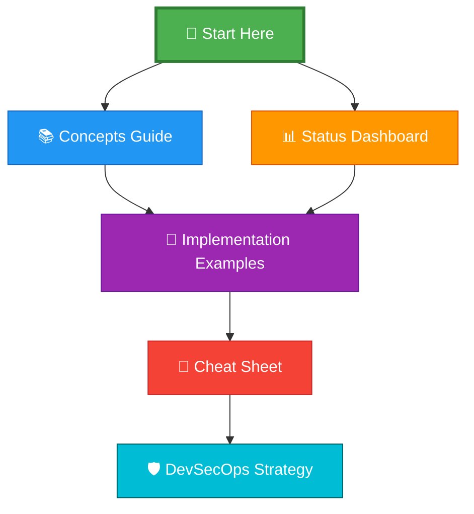
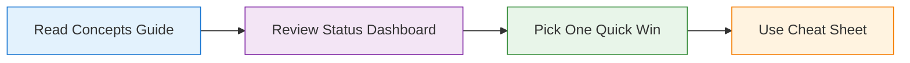
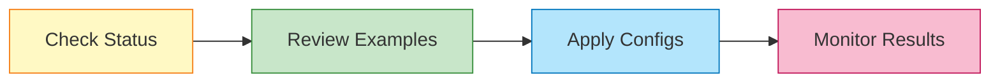
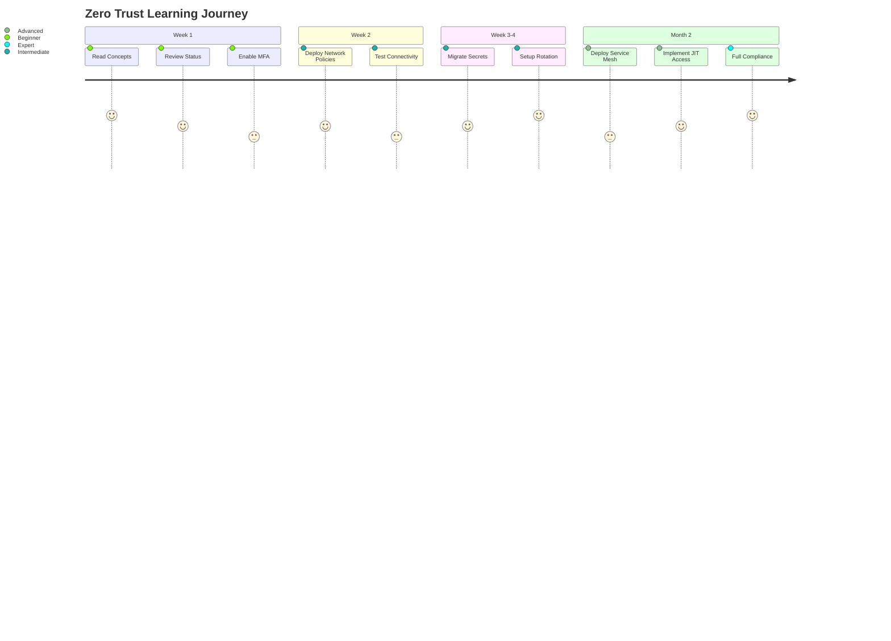

# 📚 Zero Trust Security Documentation - Index

Welcome to the complete Zero Trust Security documentation for your AWS Hub-and-Spoke infrastructure project!

---

## 🎯 What is This?

This documentation suite explains **Zero Trust Security** - a modern security framework that eliminates implicit trust and requires continuous verification of every user, device, and application.

### The Image That Started It All

This image outlines the core principles, architecture, and components of Zero Trust Security. The documentation below explains each concept in detail and shows you how to implement them in your project.

---

## 📖 Documentation Structure

---

## 📚 Documentation Files

### 1. 📘 [Zero Trust Security Guide](./ZERO_TRUST_SECURITY.md)
**Start here if you're new to Zero Trust**

**What's inside**:
- ✅ What is Zero Trust Security?
- ✅ Core principles explained with diagrams
- ✅ Architecture flow and key components
- ✅ Benefits and use cases
- ✅ Implementation roadmap

**Best for**: Understanding the concepts and theory

**Reading time**: 30 minutes

---

### 2. 📊 [Implementation Status Dashboard](./ZERO_TRUST_STATUS.md)
**See where you are and where you're going**

**What's inside**:
- ✅ Current implementation status (60% complete)
- ✅ What you already have vs. what's missing
- ✅ Priority matrix and roadmap
- ✅ Maturity model assessment
- ✅ Compliance scorecard

**Best for**: Planning your implementation journey

**Reading time**: 15 minutes

---

### 3. 🔧 [Implementation Examples](./ZERO_TRUST_IMPLEMENTATION_EXAMPLES.md)
**Ready-to-use configuration files and scripts**

**What's inside**:
- ✅ Kubernetes Network Policies (copy-paste ready)
- ✅ IAM policies with least privilege
- ✅ AWS Secrets Manager integration
- ✅ Service Mesh (Istio) configuration
- ✅ CloudWatch alarms for anomaly detection
- ✅ Session Manager setup

**Best for**: Hands-on implementation

**Reading time**: 45 minutes (or bookmark for reference)

---

### 4. 🎯 [Quick Reference Cheat Sheet](./ZERO_TRUST_CHEAT_SHEET.md)
**One-page reference for common tasks**

**What's inside**:
- ✅ Core principles summary
- ✅ Common commands (kubectl, aws cli)
- ✅ Policy templates
- ✅ Troubleshooting guide
- ✅ Emergency response procedures

**Best for**: Day-to-day operations

**Reading time**: 10 minutes (keep it handy!)

---

### 5. 🛡️ [DevSecOps Strategy](./DEVSECOPS_STRATEGY.md)
**Security tools and pipeline integration**

**What's inside**:
- ✅ 12-stage DevSecOps pipeline
- ✅ Security tool setup (SonarQube, Trivy, OWASP ZAP)
- ✅ Secret management best practices
- ✅ Kubernetes hardening
- ✅ Audit and compliance

**Best for**: CI/CD security integration

**Reading time**: 25 minutes

---

## 🚀 Quick Start Guide

### For Beginners (Never heard of Zero Trust)

**Steps**:
1. Read [ZERO_TRUST_SECURITY.md](./ZERO_TRUST_SECURITY.md) - Understand the "why"
2. Check [ZERO_TRUST_STATUS.md](./ZERO_TRUST_STATUS.md) - See where you are
3. Pick one item from "Quick Wins" section
4. Use [ZERO_TRUST_CHEAT_SHEET.md](./ZERO_TRUST_CHEAT_SHEET.md) for commands

**Time investment**: 1 hour reading + 30 minutes implementation

---

### For Experienced Users (Ready to implement)

**Steps**:
1. Review [ZERO_TRUST_STATUS.md](./ZERO_TRUST_STATUS.md) - Identify gaps
2. Open [ZERO_TRUST_IMPLEMENTATION_EXAMPLES.md](./ZERO_TRUST_IMPLEMENTATION_EXAMPLES.md)
3. Copy and customize the configuration files
4. Apply to your environment
5. Monitor with CloudWatch/GuardDuty

**Time investment**: 2-4 hours per phase

---

## 🎯 Implementation Phases

### Phase 1: Quick Wins (Week 1-2)
**Goal**: Achieve 75% Zero Trust compliance

**Tasks**:
- [ ] Enable MFA for all AWS users
- [ ] Deploy Kubernetes Network Policies
- [ ] Enable AWS GuardDuty
- [ ] Create CloudWatch security alarms

**Documents to use**:
- [Implementation Examples](./ZERO_TRUST_IMPLEMENTATION_EXAMPLES.md) - Network Policies section
- [Cheat Sheet](./ZERO_TRUST_CHEAT_SHEET.md) - IAM and GuardDuty commands

---

### Phase 2: Secret Management (Week 3-4)
**Goal**: Achieve 85% Zero Trust compliance

**Tasks**:
- [ ] Create secrets in AWS Secrets Manager
- [ ] Install External Secrets Operator
- [ ] Migrate application secrets
- [ ] Enable automatic rotation

**Documents to use**:
- [Implementation Examples](./ZERO_TRUST_IMPLEMENTATION_EXAMPLES.md) - Secrets Manager section
- [DevSecOps Strategy](./DEVSECOPS_STRATEGY.md) - Secret Management section

---

### Phase 3: Advanced Features (Month 2)
**Goal**: Achieve 95% Zero Trust compliance

**Tasks**:
- [ ] Deploy Istio Service Mesh
- [ ] Implement Just-in-Time access
- [ ] Replace SSH with Session Manager
- [ ] Enable AWS Security Hub

**Documents to use**:
- [Implementation Examples](./ZERO_TRUST_IMPLEMENTATION_EXAMPLES.md) - All sections
- [Concepts Guide](./ZERO_TRUST_SECURITY.md) - Advanced topics

---

## 📊 How to Use This Documentation

### Scenario 1: "I need to understand Zero Trust"
**Path**: Concepts Guide → Status Dashboard
**Time**: 45 minutes
**Outcome**: Solid understanding of principles and current state

---

### Scenario 2: "I want to implement network policies"
**Path**: Implementation Examples (Network Policies) → Cheat Sheet (Troubleshooting)
**Time**: 1 hour
**Outcome**: Network policies deployed and tested

---

### Scenario 3: "I need to migrate to AWS Secrets Manager"
**Path**: DevSecOps Strategy (Secrets) → Implementation Examples (Secrets) → Cheat Sheet (Commands)
**Time**: 2-3 hours
**Outcome**: Secrets migrated and synced to Kubernetes

---

### Scenario 4: "I'm responding to a security incident"
**Path**: Cheat Sheet (Incident Response) → Status Dashboard (Gaps)
**Time**: 15 minutes
**Outcome**: Immediate response steps + long-term fixes

---

## 🎓 Learning Path

---

## 📈 Success Metrics

Track your progress with these metrics:

| Metric | Current | Target | Status |
|:-------|:--------|:-------|:-------|
| **Zero Trust Compliance** | 60% | 95% | 🟡 In Progress |
| **Network Segmentation** | 50% | 100% | 🟡 In Progress |
| **Secret Management** | 40% | 100% | 🔴 Not Started |
| **MFA Adoption** | 0% | 100% | 🔴 Critical |
| **Monitoring Coverage** | 50% | 90% | 🟡 In Progress |

---

## 🔗 External Resources

### Official Documentation
- [NIST Zero Trust Architecture](https://www.nist.gov/publications/zero-trust-architecture)
- [AWS Zero Trust on AWS](https://aws.amazon.com/security/zero-trust/)
- [Kubernetes Network Policies](https://kubernetes.io/docs/concepts/services-networking/network-policies/)

### Tools & Frameworks
- [Istio Service Mesh](https://istio.io/)
- [Calico Network Policies](https://www.tigera.io/project-calico/)
- [External Secrets Operator](https://external-secrets.io/)
- [AWS Security Hub](https://aws.amazon.com/security-hub/)

### Training & Certification
- [AWS Security Specialty Certification](https://aws.amazon.com/certification/certified-security-specialty/)
- [Kubernetes Security Specialist (CKS)](https://www.cncf.io/certification/cks/)

---

## 🤝 Contributing

This documentation is a living resource. As you implement Zero Trust in your project:

1. **Update status** - Mark items as complete in [ZERO_TRUST_STATUS.md](./ZERO_TRUST_STATUS.md)
2. **Add examples** - Share working configurations in [ZERO_TRUST_IMPLEMENTATION_EXAMPLES.md](./ZERO_TRUST_IMPLEMENTATION_EXAMPLES.md)
3. **Document lessons** - Add troubleshooting tips to [ZERO_TRUST_CHEAT_SHEET.md](./ZERO_TRUST_CHEAT_SHEET.md)

---

## 📞 Support

### Common Questions

<b>Q: Where should I start?</b>

**A**: Start with the [Concepts Guide](./ZERO_TRUST_SECURITY.md) to understand the fundamentals, then check the [Status Dashboard](./ZERO_TRUST_STATUS.md) to see what's already implemented.

<b>Q: Will this break my application?</b>

**A**: Not if you follow the phased approach. Always test in dev first, and use the monitoring mode for network policies before enforcing them.

<b>Q: How long will full implementation take?</b>

**A**:
- Phase 1 (Quick Wins): 1-2 weeks
- Phase 2 (Secrets): 2-3 weeks
- Phase 3 (Advanced): 4-6 weeks
- **Total**: 2-3 months for 95% compliance

<b>Q: What's the most important thing to do first?</b>

**A**: Enable MFA for all users. This single change prevents 99% of credential theft attacks and takes less than 1 hour.

---

## 🎯 Next Steps

1. **Today**: Read the [Concepts Guide](./ZERO_TRUST_SECURITY.md) (30 minutes)
2. **This Week**: Review [Status Dashboard](./ZERO_TRUST_STATUS.md) and enable MFA (1 hour)
3. **Next Week**: Deploy Network Policies using [Implementation Examples](./ZERO_TRUST_IMPLEMENTATION_EXAMPLES.md) (2 hours)
4. **This Month**: Complete Phase 1 (Quick Wins)

---

## 📝 Document Versions

| Document | Version | Last Updated |
|:---------|:--------|:-------------|
| Index (this file) | 1.0 | 2025-12-12 |
| Concepts Guide | 1.0 | 2025-12-12 |
| Status Dashboard | 1.0 | 2025-12-12 |
| Implementation Examples | 1.0 | 2025-12-12 |
| Cheat Sheet | 1.0 | 2025-12-12 |
| DevSecOps Strategy | 1.0 | 2025-12-05 |

---

## 🌟 Key Takeaways

> [!IMPORTANT]
> **Zero Trust is a Journey, Not a Destination**
> - You don't need to implement everything at once
> - Start with quick wins (MFA, Network Policies)
> - Gradually add more controls over time
> - Continuously monitor and improve

> [!TIP]
> **Use the Right Document for the Right Task**
> - **Learning**: Concepts Guide
> - **Planning**: Status Dashboard
> - **Implementing**: Implementation Examples
> - **Operating**: Cheat Sheet

> [!WARNING]
> **Don't Skip Testing**
> - Always test in dev environment first
> - Use monitoring mode before enforcing policies
> - Have a rollback plan ready

---

**Ready to begin?** Start with the [Zero Trust Security Guide](./ZERO_TRUST_SECURITY.md) →

---

**Maintained By**: DevSecOps Team
**Last Updated**: December 12, 2025
**Next Review**: January 12, 2026
