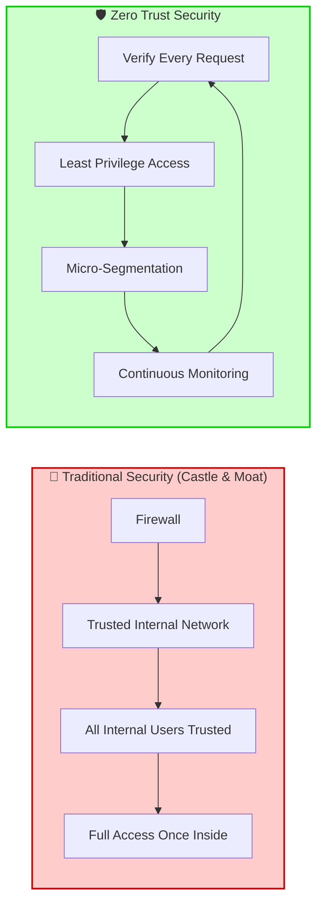
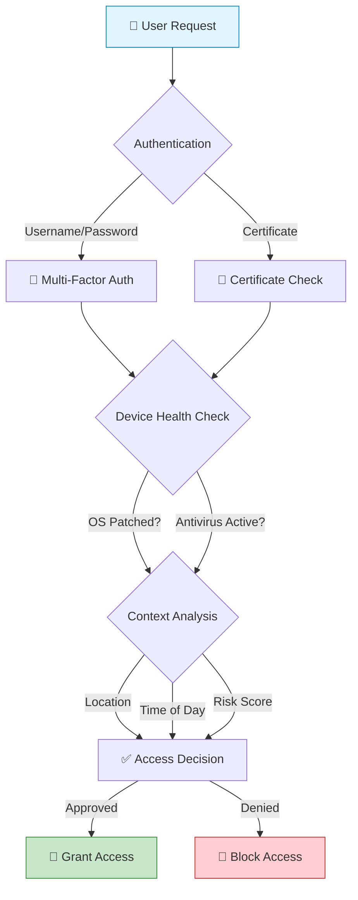
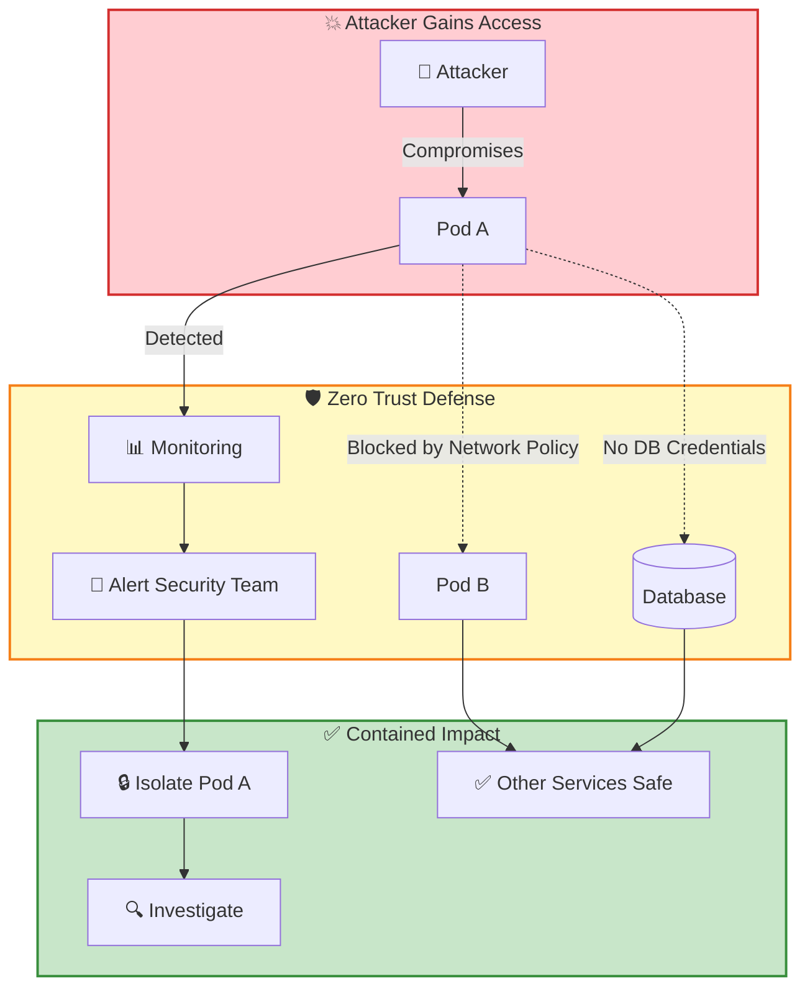
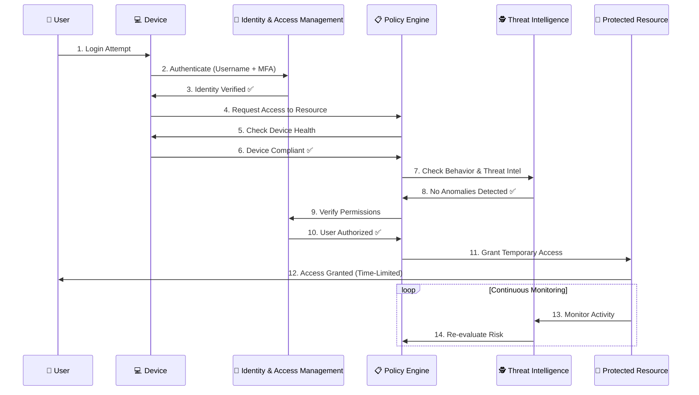
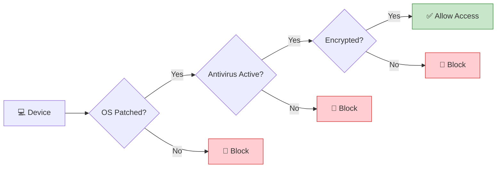
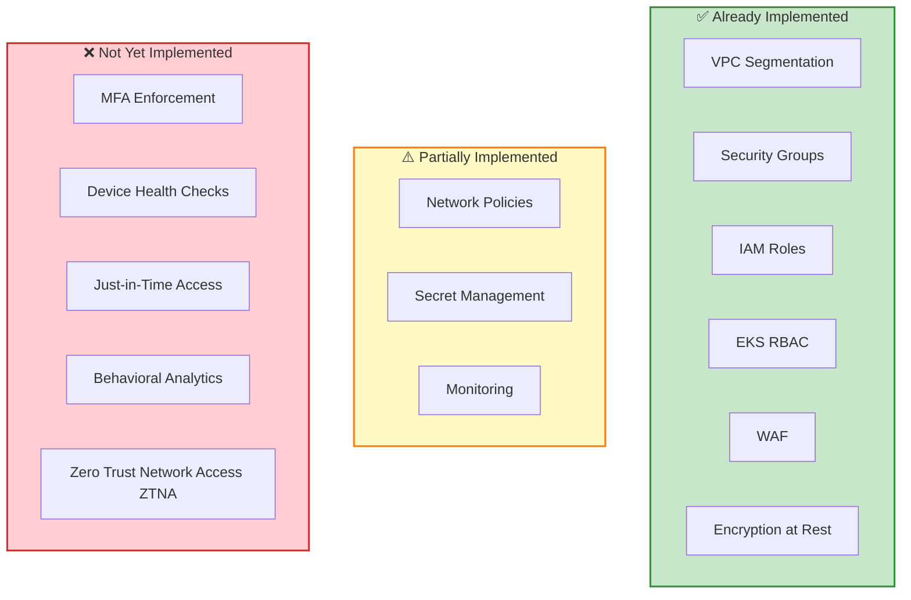
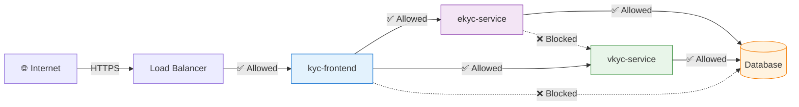
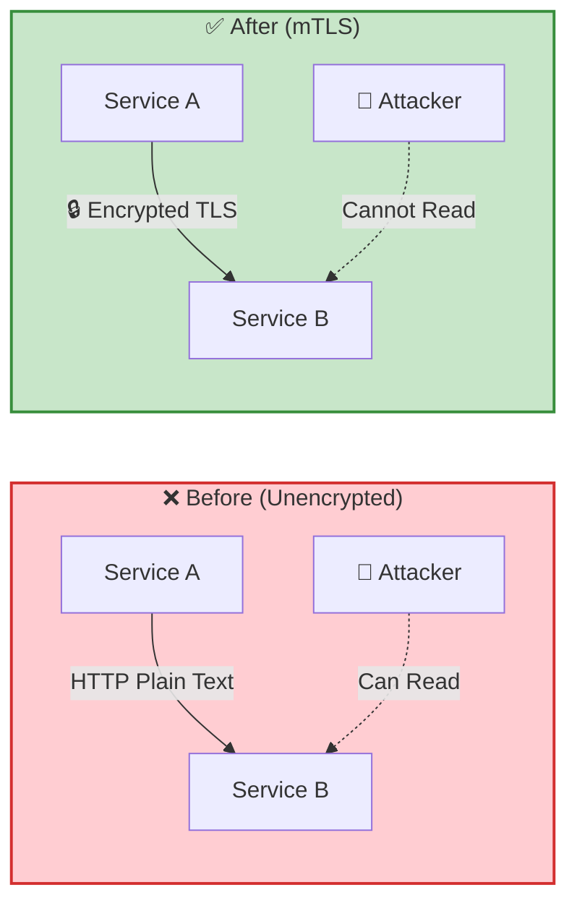
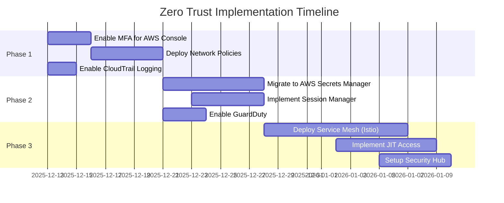

# 🛡️ Zero Trust Security - Complete Implementation Guide


---

## 📋 Table of Contents

1. [What is Zero Trust Security?](#what-is-zero-trust-security)
2. [Core Principles](#core-principles)
3. [Architecture Flow](#architecture-flow)
4. [Key Components](#key-components)
5. [Implementation in Your Project](#implementation-in-your-project)
6. [Benefits](#benefits)
7. [Practical Examples](#practical-examples)
8. [Implementation Roadmap](#implementation-roadmap)

---

## 🎯 What is Zero Trust Security?

> **"Never Trust, Always Verify"**

Zero Trust is a security framework that **eliminates implicit trust** and requires **continuous verification** of every user, device, and application attempting to access resources. Unlike traditional perimeter-based security (castle-and-moat), Zero Trust assumes that **threats exist both inside and outside** the network.

### Traditional Security vs Zero Trust



---

## 🔑 Core Principles

Zero Trust is built on three fundamental principles:

### 1️⃣ Verify Explicitly

**Concept**: Never assume trust. Always authenticate and authorize based on all available data points.

**What it means**:
- ✅ Verify user identity (Who are you?)
- ✅ Verify device health (Is your device secure?)
- ✅ Verify context (Where are you? What time is it?)
- ✅ Verify behavior (Is this normal for you?)

**Implementation**:


---

### 2️⃣ Least Privilege Access

**Concept**: Grant users the **minimum permissions** necessary to perform their job. Nothing more.

**What it means**:
- 🔒 Just-in-time (JIT) access - temporary permissions
- 🔒 Just-enough-access (JEA) - only what's needed
- 🔒 Time-bound permissions - expire after use

**Example**:
```yaml
# ❌ BAD: Giving full admin access
apiVersion: rbac.authorization.k8s.io/v1
kind: ClusterRoleBinding
metadata:
  name: developer-admin
roleRef:
  kind: ClusterRole
  name: cluster-admin  # Full control over everything!
subjects:
- kind: User
  name: developer@company.com

---

# ✅ GOOD: Least privilege - only what's needed
apiVersion: rbac.authorization.k8s.io/v1
kind: RoleBinding
metadata:
  name: developer-app-access
  namespace: kyc-app  # Limited to one namespace
roleRef:
  kind: Role
  name: app-deployer  # Custom role with limited permissions
subjects:
- kind: User
  name: developer@company.com
```

---

### 3️⃣ Assume Breach

**Concept**: Design your system as if it's **already compromised**. Plan for failure.

**What it means**:
- 🚨 Segment your network (micro-segmentation)
- 🚨 Encrypt everything (data in transit and at rest)
- 🚨 Monitor continuously (detect anomalies)
- 🚨 Limit blast radius (contain damage)

**Visualization**:


---

## 🏗️ Architecture Flow

Here's how Zero Trust works in practice:



### Key Stages Explained:

| Stage | Component | What Happens |
|:------|:----------|:-------------|
| **1-3** | **Authentication** | User proves identity (password + MFA) |
| **4-6** | **Device Security** | System checks if device is secure (OS updated, antivirus running) |
| **7-8** | **Threat Analysis** | AI analyzes behavior for anomalies (unusual login location, time) |
| **9-10** | **Authorization** | Verify user has permission for this specific resource |
| **11-12** | **Access Grant** | Temporary, limited access granted |
| **13-14** | **Continuous Monitoring** | Ongoing surveillance for suspicious activity |

---

## 🧩 Key Components

### 1. Identity & Access Management (IAM)

**Purpose**: Centralized identity verification and policy enforcement.

**In Your Project**:
- **AWS IAM** for infrastructure access
- **Kubernetes RBAC** for cluster access
- **Service Accounts** for pod-to-pod communication

**Example - IAM Role for Jenkins**:
```json
{
  "Version": "2012-10-17",
  "Statement": [
    {
      "Effect": "Allow",
      "Action": [
        "ec2:DescribeInstances",
        "eks:DescribeCluster"
      ],
      "Resource": "*",
      "Condition": {
        "IpAddress": {
          "aws:SourceIp": "10.0.0.0/8"  // Only from Management VPC
        }
      }
    }
  ]
}
```

---

### 2. Device Security

**Purpose**: Ensure endpoints are healthy and compliant before granting access.

**Checks Performed**:
- ✅ Operating system is up-to-date
- ✅ Antivirus/EDR is running
- ✅ Disk encryption is enabled
- ✅ Device is registered in inventory

**Implementation**:


---

### 3. Network Segmentation (Micro-Segmentation)

**Purpose**: Divide the network into small, isolated zones to limit lateral movement.

**Traditional Network**:
```
┌─────────────────────────────────────┐
│  Flat Network (All Services Trust) │
│  ┌────┐  ┌────┐  ┌────┐  ┌────┐   │
│  │ A  │──│ B  │──│ C  │──│ DB │   │
│  └────┘  └────┘  └────┘  └────┘   │
│  If A is compromised, attacker     │
│  can reach B, C, and DB easily!    │
└─────────────────────────────────────┘
```

**Zero Trust Network (Micro-Segmentation)**:
```
┌─────────────────────────────────────┐
│  Segmented Network (Isolated Zones)│
│  ┌────┐  ╳  ┌────┐  ╳  ┌────┐     │
│  │ A  │─────│ B  │─────│ DB │     │
│  └────┘     └────┘     └────┘     │
│         ╲         ╱                │
│          ╲       ╱                 │
│           ┌────┐                   │
│           │ C  │ (Isolated)        │
│           └────┘                   │
│  Each service has explicit rules   │
│  A can only talk to B              │
│  B can only talk to DB             │
│  C is completely isolated          │
└─────────────────────────────────────┘
```

**Kubernetes Network Policy Example**:
```yaml
# Only allow frontend to talk to backend
apiVersion: networking.k8s.io/v1
kind: NetworkPolicy
metadata:
  name: backend-ingress-policy
  namespace: kyc-app
spec:
  podSelector:
    matchLabels:
      app: ekyc-service  # Backend service
  policyTypes:
  - Ingress
  ingress:
  - from:
    - podSelector:
        matchLabels:
          app: kyc-frontend  # Only frontend can access
    ports:
    - protocol: TCP
      port: 3000
```

---

### 4. Continuous Monitoring

**Purpose**: Real-time analytics and threat detection.

**What to Monitor**:
- 📊 User login patterns
- 📊 API call frequency
- 📊 Data access patterns
- 📊 Network traffic anomalies

**Tools in Your Project**:
- **CloudWatch** - AWS resource monitoring
- **CloudTrail** - API audit logs
- **GuardDuty** - Threat detection
- **Container Insights** - EKS monitoring

**Example Alert**:
```yaml
# CloudWatch Alarm for Suspicious Activity
AlarmName: UnusualAPICallVolume
MetricName: APICallCount
Threshold: 1000  # Alert if > 1000 calls in 5 minutes
EvaluationPeriods: 1
ComparisonOperator: GreaterThanThreshold
AlarmActions:
  - arn:aws:sns:us-east-1:123456789:security-alerts
```

---

## 🚀 Implementation in Your Project

### Current State Analysis

Let's analyze what Zero Trust components you **already have** and what you **need to add**:



---

### Implementation Checklist

#### ✅ Phase 1: Foundation (Already Done)

- [x] **VPC Segmentation**: Transit, Application, and Management VPCs
- [x] **IAM Roles**: Least privilege for EC2, EKS, Lambda
- [x] **Security Groups**: Restrict traffic between resources
- [x] **WAF**: Protect against web attacks
- [x] **Encryption**: KMS encryption for EBS, RDS, S3

#### ⚠️ Phase 2: Enhancement (In Progress)

- [ ] **Kubernetes Network Policies**: Implement micro-segmentation
- [ ] **AWS Secrets Manager**: Migrate from Kubernetes Secrets
- [ ] **CloudWatch Alarms**: Set up anomaly detection
- [ ] **GuardDuty**: Enable threat detection

#### ❌ Phase 3: Advanced (To Do)

- [ ] **MFA for All Users**: Enforce multi-factor authentication
- [ ] **AWS Systems Manager Session Manager**: Replace SSH with audited sessions
- [ ] **Service Mesh (Istio)**: mTLS for pod-to-pod encryption
- [ ] **AWS Security Hub**: Centralized security findings

---

## 🎯 Practical Examples

### Example 1: Implementing Network Policies

**Scenario**: Your KYC application has three services:
- `kyc-frontend` (React app)
- `ekyc-service` (Backend API)
- `vkyc-service` (Video KYC API)

**Problem**: Currently, all pods can talk to each other. If `kyc-frontend` is compromised, an attacker could directly access the database.

**Solution**: Implement Network Policies

```yaml
# File: kyc-app/k8s/network-policies.yaml

---
# 1. Default Deny All Traffic
apiVersion: networking.k8s.io/v1
kind: NetworkPolicy
metadata:
  name: default-deny-all
  namespace: kyc-app
spec:
  podSelector: {}  # Applies to all pods
  policyTypes:
  - Ingress
  - Egress

---
# 2. Allow Frontend to Access Backend APIs Only
apiVersion: networking.k8s.io/v1
kind: NetworkPolicy
metadata:
  name: frontend-egress-policy
  namespace: kyc-app
spec:
  podSelector:
    matchLabels:
      app: kyc-frontend
  policyTypes:
  - Egress
  egress:
  # Allow DNS resolution
  - to:
    - namespaceSelector:
        matchLabels:
          name: kube-system
    ports:
    - protocol: UDP
      port: 53
  # Allow access to eKYC service
  - to:
    - podSelector:
        matchLabels:
          app: ekyc-service
    ports:
    - protocol: TCP
      port: 3000
  # Allow access to vKYC service
  - to:
    - podSelector:
        matchLabels:
          app: vkyc-service
    ports:
    - protocol: TCP
      port: 3001

---
# 3. Allow Backend to Access Database Only
apiVersion: networking.k8s.io/v1
kind: NetworkPolicy
metadata:
  name: backend-egress-policy
  namespace: kyc-app
spec:
  podSelector:
    matchLabels:
      app: ekyc-service
  policyTypes:
  - Egress
  egress:
  # Allow DNS
  - to:
    - namespaceSelector:
        matchLabels:
          name: kube-system
    ports:
    - protocol: UDP
      port: 53
  # Allow access to RDS (via CIDR)
  - to:
    - ipBlock:
        cidr: 10.0.20.0/24  # Database subnet CIDR
    ports:
    - protocol: TCP
      port: 5432  # PostgreSQL

---
# 4. Allow Ingress to Frontend from Load Balancer
apiVersion: networking.k8s.io/v1
kind: NetworkPolicy
metadata:
  name: frontend-ingress-policy
  namespace: kyc-app
spec:
  podSelector:
    matchLabels:
      app: kyc-frontend
  policyTypes:
  - Ingress
  ingress:
  - from:
    - ipBlock:
        cidr: 0.0.0.0/0  # Allow from anywhere (via ALB)
    ports:
    - protocol: TCP
      port: 80
```

**Visual Representation**:


---

### Example 2: Implementing Just-in-Time (JIT) Access

**Scenario**: Developers need occasional access to production EKS cluster for debugging.

**Problem**: Giving permanent access violates least privilege principle.

**Solution**: Use AWS Systems Manager Session Manager with time-limited access

```bash
# Step 1: Developer requests access via Slack/ServiceNow
# Step 2: Security approves for 2 hours
# Step 3: Automated script grants temporary IAM permissions

# grant-temporary-access.sh
#!/bin/bash

DEVELOPER_USER="arn:aws:iam::123456789:user/developer@company.com"
ROLE_ARN="arn:aws:iam::123456789:role/EKS-ReadOnly-Role"
DURATION=7200  # 2 hours in seconds

# Assume role and get temporary credentials
aws sts assume-role \
  --role-arn $ROLE_ARN \
  --role-session-name "debug-session-$(date +%s)" \
  --duration-seconds $DURATION \
  --policy '{
    "Version": "2012-10-17",
    "Statement": [{
      "Effect": "Allow",
      "Action": [
        "eks:DescribeCluster",
        "eks:ListClusters"
      ],
      "Resource": "*"
    }]
  }'

# After 2 hours, credentials automatically expire!
```

---

### Example 3: Encrypting Pod-to-Pod Communication

**Scenario**: Your microservices communicate over HTTP, which is unencrypted.

**Problem**: If an attacker gains access to the network, they can intercept traffic.

**Solution**: Implement mTLS (mutual TLS) using a Service Mesh

```yaml
# Install Istio service mesh
# This automatically encrypts all pod-to-pod traffic

# Step 1: Enable Istio injection for your namespace
kubectl label namespace kyc-app istio-injection=enabled

# Step 2: Restart pods to inject Istio sidecar
kubectl rollout restart deployment -n kyc-app

# Step 3: Create a PeerAuthentication policy
apiVersion: security.istio.io/v1beta1
kind: PeerAuthentication
metadata:
  name: default-mtls
  namespace: kyc-app
spec:
  mtls:
    mode: STRICT  # Enforce mTLS for all services
```

**Result**:


---

## 📊 Benefits

### 1. Reduced Attack Surface

**Before Zero Trust**:
```
┌─────────────────────────────────┐
│  Large Attack Surface           │
│  ┌─────────────────────────┐   │
│  │  All Internal Traffic   │   │
│  │  Trusted by Default     │   │
│  │  ┌───┐ ┌───┐ ┌───┐     │   │
│  │  │ A │─│ B │─│ C │     │   │
│  │  └───┘ └───┘ └───┘     │   │
│  └─────────────────────────┘   │
│  Blast Radius: Everything!     │
└─────────────────────────────────┘
```

**After Zero Trust**:
```
┌─────────────────────────────────┐
│  Minimal Attack Surface         │
│  ┌───┐   ┌───┐   ┌───┐         │
│  │ A │   │ B │   │ C │         │
│  └─┬─┘   └─┬─┘   └─┬─┘         │
│    │       │       │           │
│    └───────┴───────┘           │
│    Explicit Policies Only      │
│  Blast Radius: Single Service  │
└─────────────────────────────────┘
```

---

### 2. Stronger Access Control

| Traditional | Zero Trust |
|:------------|:-----------|
| 🔓 Perimeter-based (VPN = full access) | 🔐 Identity-based (verify every request) |
| 🔓 Static permissions | 🔐 Dynamic, context-aware |
| 🔓 Trust internal users | 🔐 Verify all users, internal or external |

---

### 3. Better Visibility

**Monitoring Dashboard Example**:
```
┌─────────────────────────────────────────────┐
│  Zero Trust Security Dashboard              │
├─────────────────────────────────────────────┤
│  📊 Authentication Events (Last 24h)        │
│  ├─ Successful: 1,245                       │
│  ├─ Failed: 12 ⚠️                           │
│  └─ MFA Bypassed: 0 ✅                      │
│                                             │
│  🔍 Access Requests                         │
│  ├─ Approved: 89                            │
│  ├─ Denied: 3 (Policy Violation)           │
│  └─ Pending: 1                              │
│                                             │
│  🚨 Anomalies Detected                      │
│  ├─ Unusual Login Location: 2 🔴           │
│  ├─ High API Call Rate: 1 🟡               │
│  └─ Privilege Escalation Attempt: 0 ✅     │
└─────────────────────────────────────────────┘
```

---

## 🗺️ Implementation Roadmap

### Week 1-2: Quick Wins



---

### Step-by-Step Guide

#### 🔹 Step 1: Enable MFA (Multi-Factor Authentication)

```bash
# For AWS Console Users
# 1. Go to IAM Console
# 2. Select User
# 3. Security Credentials Tab
# 4. Assign MFA Device (Virtual or Hardware)

# For CLI/API Access - Require MFA in IAM Policy
{
  "Version": "2012-10-17",
  "Statement": [{
    "Effect": "Deny",
    "Action": "*",
    "Resource": "*",
    "Condition": {
      "BoolIfExists": {
        "aws:MultiFactorAuthPresent": "false"
      }
    }
  }]
}
```

---

#### 🔹 Step 2: Deploy Network Policies

```bash
# Apply the network policies created earlier
kubectl apply -f kyc-app/k8s/network-policies.yaml

# Verify policies are active
kubectl get networkpolicies -n kyc-app

# Test connectivity (should fail if blocked)
kubectl exec -it <frontend-pod> -n kyc-app -- curl http://database:5432
# Expected: Connection refused or timeout
```

---

#### 🔹 Step 3: Enable AWS GuardDuty

```bash
# Enable GuardDuty for threat detection
aws guardduty create-detector --enable

# Create SNS topic for alerts
aws sns create-topic --name security-alerts

# Subscribe your email
aws sns subscribe \
  --topic-arn arn:aws:sns:us-east-1:123456789:security-alerts \
  --protocol email \
  --notification-endpoint security@company.com
```

---

#### 🔹 Step 4: Migrate to AWS Secrets Manager

```bash
# Create secret in AWS Secrets Manager
aws secretsmanager create-secret \
  --name prod/kyc-app/database \
  --description "KYC App Database Credentials" \
  --secret-string '{
    "username": "kyc_admin",
    "password": "SuperSecurePassword123!",
    "host": "kyc-db.cluster-xxxxx.us-east-1.rds.amazonaws.com",
    "port": "5432",
    "database": "kyc_production"
  }'

# Install External Secrets Operator in EKS
helm repo add external-secrets https://charts.external-secrets.io
helm install external-secrets \
  external-secrets/external-secrets \
  -n external-secrets-system \
  --create-namespace

# Create SecretStore
kubectl apply -f - <<EOF
apiVersion: external-secrets.io/v1beta1
kind: SecretStore
metadata:
  name: aws-secrets-manager
  namespace: kyc-app
spec:
  provider:
    aws:
      service: SecretsManager
      region: us-east-1
      auth:
        jwt:
          serviceAccountRef:
            name: external-secrets-sa
EOF

# Create ExternalSecret
kubectl apply -f - <<EOF
apiVersion: external-secrets.io/v1beta1
kind: ExternalSecret
metadata:
  name: database-credentials
  namespace: kyc-app
spec:
  refreshInterval: 1h
  secretStoreRef:
    name: aws-secrets-manager
    kind: SecretStore
  target:
    name: db-secrets
    creationPolicy: Owner
  data:
  - secretKey: username
    remoteRef:
      key: prod/kyc-app/database
      property: username
  - secretKey: password
    remoteRef:
      key: prod/kyc-app/database
      property: password
EOF
```

---

## 📚 Additional Resources

### Official Documentation
- [NIST Zero Trust Architecture](https://www.nist.gov/publications/zero-trust-architecture)
- [AWS Zero Trust on AWS](https://aws.amazon.com/security/zero-trust/)
- [Kubernetes Network Policies](https://kubernetes.io/docs/concepts/services-networking/network-policies/)

### Tools & Frameworks
- **Istio** - Service mesh for mTLS
- **Calico** - Advanced network policies
- **AWS Security Hub** - Centralized security management
- **Teleport** - Zero Trust access for infrastructure

---

## 🎓 Summary

Zero Trust Security is **not a product**, it's a **journey**. Here's what you need to remember:

> [!IMPORTANT]
> **Core Principles**
> 1. **Verify Explicitly** - Always authenticate and authorize
> 2. **Least Privilege** - Grant minimum necessary access
> 3. **Assume Breach** - Design for failure and containment

> [!TIP]
> **Start Small, Think Big**
> - Begin with MFA and network policies
> - Gradually add more controls
> - Continuously monitor and improve

> [!WARNING]
> **Common Mistakes to Avoid**
> - Don't try to implement everything at once
> - Don't forget to train your team
> - Don't neglect monitoring and logging

---

## 🤝 Contributing

This is a living document. As you implement Zero Trust in your project, update this guide with:
- Lessons learned
- New tools and techniques
- Real-world examples from your environment

---

**Last Updated**: December 12, 2025
**Version**: 1.0
**Maintained By**: DevSecOps Team
