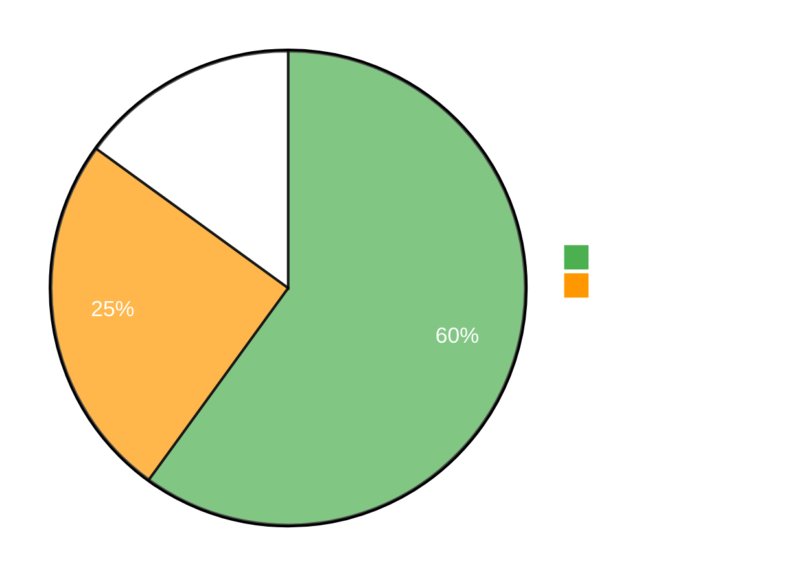
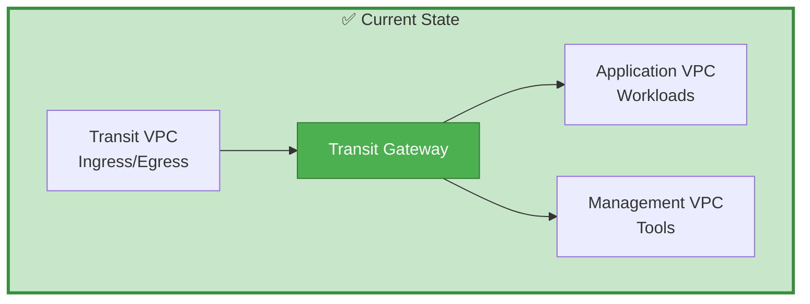
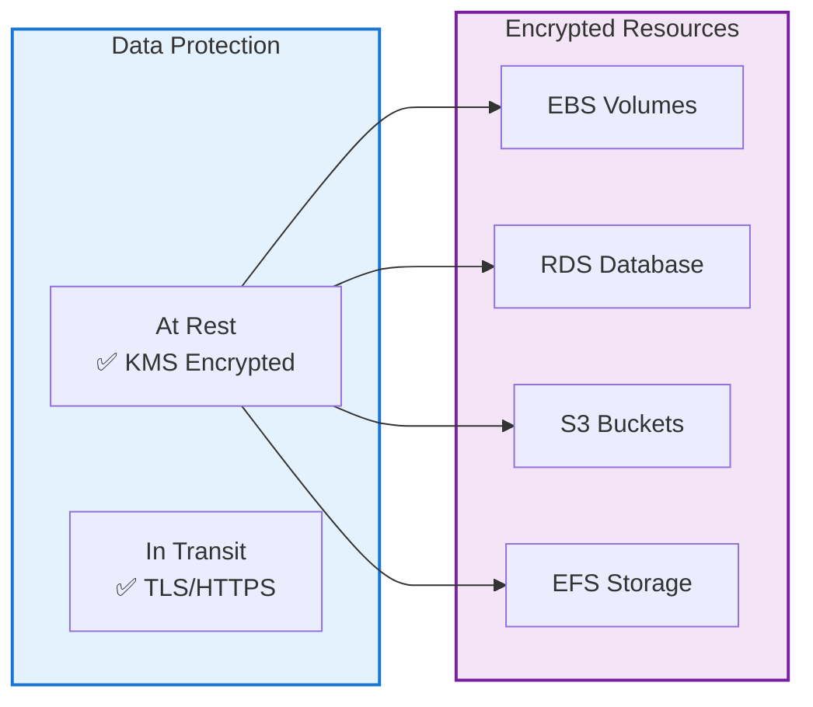
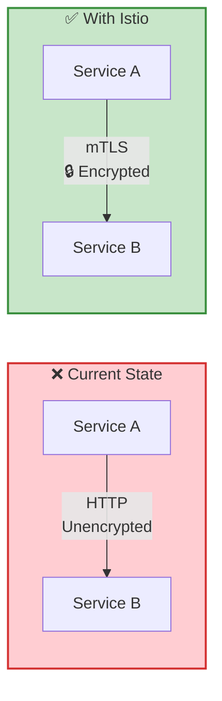
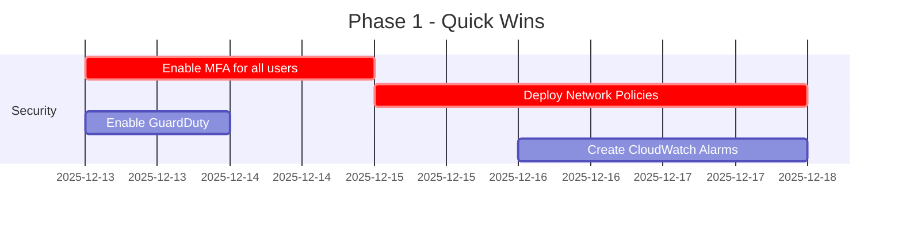
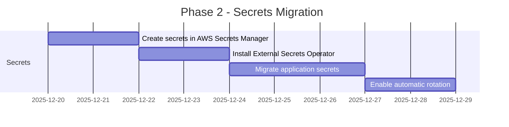
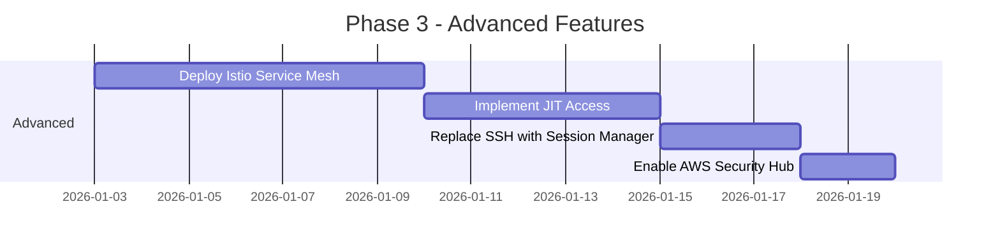
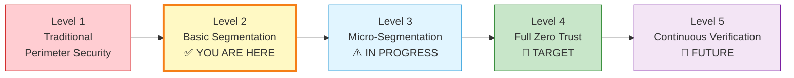
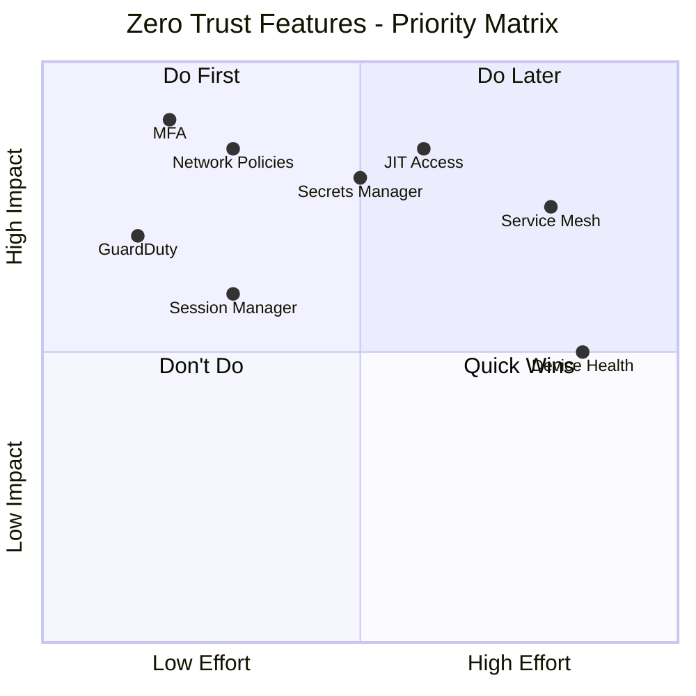

# 🎯 Zero Trust Implementation Status

This document provides a visual overview of your current Zero Trust implementation status and a roadmap for full adoption.

---

## 📊 Current Implementation Status

### Overall Progress: 60% Complete



---

## ✅ What You Already Have (Implemented)

### 1. Network Segmentation - VPC Level
**Status**: ✅ **COMPLETE**



**What this gives you**:
- ✅ Isolated network zones
- ✅ Controlled traffic flow via Transit Gateway
- ✅ Separate blast radius for each VPC

---

### 2. Identity & Access Management
**Status**: ✅ **COMPLETE**

**Current IAM Implementation**:
- ✅ Separate IAM roles for each service (Jenkins, EKS, Bastion)
- ✅ Resource-based policies (S3 bucket policies, KMS key policies)
- ✅ Service accounts for Kubernetes workloads

**Example from your project**:
```
Jenkins Role → Can only:
  - Read EKS cluster info
  - Push to specific ECR repositories
  - Write to artifact S3 bucket
```

---

### 3. Encryption
**Status**: ✅ **COMPLETE**



---

### 4. Web Application Firewall (WAF)
**Status**: ✅ **COMPLETE**

**Protection Against**:
- ✅ SQL Injection
- ✅ Cross-Site Scripting (XSS)
- ✅ Bad Bots
- ✅ Rate Limiting

---

## ⚠️ What's Partially Implemented (In Progress)

### 1. Micro-Segmentation (Kubernetes Level)
**Status**: ⚠️ **PARTIAL** (25% Complete)

**Current State**:
```
┌─────────────────────────────────┐
│  All Pods Can Talk to Each     │
│  Other (Flat Network)           │
│  ┌────┐  ┌────┐  ┌────┐        │
│  │ FE │──│ BE │──│ DB │        │
│  └────┘  └────┘  └────┘        │
└─────────────────────────────────┘
```

**Desired State**:
```
┌─────────────────────────────────┐
│  Explicit Allow Rules Only      │
│  ┌────┐  ╳  ┌────┐  ╳  ┌────┐  │
│  │ FE │─────│ BE │─────│ DB │  │
│  └────┘     └────┘     └────┘  │
│  Network Policies Enforced      │
└─────────────────────────────────┘
```

**Action Required**: Apply the network policies from `ZERO_TRUST_IMPLEMENTATION_EXAMPLES.md`

---

### 2. Secret Management
**Status**: ⚠️ **PARTIAL** (50% Complete)

**Current**: Kubernetes Secrets (Base64 encoded)
**Desired**: AWS Secrets Manager with External Secrets Operator

| Feature | Current (K8s Secrets) | Desired (AWS Secrets Manager) |
|:--------|:---------------------|:------------------------------|
| Encryption | ⚠️ Base64 (not encrypted) | ✅ KMS encrypted |
| Rotation | ❌ Manual | ✅ Automatic |
| Audit | ❌ Limited | ✅ CloudTrail logs |
| Centralized | ❌ Per cluster | ✅ Cross-service |

**Action Required**: Follow the migration guide in implementation examples

---

### 3. Monitoring & Alerting
**Status**: ⚠️ **PARTIAL** (40% Complete)

**Current**:
- ✅ CloudWatch metrics collection
- ✅ CloudTrail enabled
- ⚠️ Limited alarms
- ❌ No anomaly detection

**Desired**:
- ✅ CloudWatch metrics
- ✅ CloudTrail
- ✅ Comprehensive alarms
- ✅ GuardDuty threat detection
- ✅ Security Hub

---

## ❌ What's Missing (Not Started)

### 1. Multi-Factor Authentication (MFA)
**Status**: ❌ **NOT IMPLEMENTED**

**Impact**: High
**Effort**: Low
**Priority**: 🔴 **CRITICAL**

**What to do**:
```bash
# Enforce MFA for all IAM users
# Add this policy to all user roles:
{
  "Effect": "Deny",
  "Action": "*",
  "Resource": "*",
  "Condition": {
    "BoolIfExists": {
      "aws:MultiFactorAuthPresent": "false"
    }
  }
}
```

---

### 2. Device Health Checks
**Status**: ❌ **NOT IMPLEMENTED**

**Impact**: Medium
**Effort**: High
**Priority**: 🟡 **MEDIUM**

**What this means**:
- Check if user's device is patched
- Verify antivirus is running
- Ensure disk encryption is enabled

**Recommendation**: Start with AWS Systems Manager for EC2 instances

---

### 3. Just-in-Time (JIT) Access
**Status**: ❌ **NOT IMPLEMENTED**

**Impact**: High
**Effort**: Medium
**Priority**: 🔴 **HIGH**

**Current Problem**:
```
Developer has permanent access to production
  ↓
If credentials are stolen, attacker has permanent access too!
```

**Solution**:
```
Developer requests access for 2 hours
  ↓
Automated approval grants temporary credentials
  ↓
After 2 hours, credentials automatically expire
```

---

### 4. Service Mesh (mTLS)
**Status**: ❌ **NOT IMPLEMENTED**

**Impact**: High
**Effort**: High
**Priority**: 🟡 **MEDIUM**

**Current**: Pod-to-pod traffic is unencrypted HTTP
**Desired**: All traffic encrypted with mutual TLS (mTLS)



---

### 5. Session Manager (SSH Replacement)
**Status**: ❌ **NOT IMPLEMENTED**

**Impact**: Medium
**Effort**: Low
**Priority**: 🟡 **MEDIUM**

**Current**: SSH with key pairs
**Desired**: AWS Systems Manager Session Manager

**Benefits**:
- ✅ No open SSH port (port 22)
- ✅ No SSH keys to manage
- ✅ Full audit trail in CloudTrail
- ✅ Session recording

---

## 🗺️ Implementation Roadmap

### Phase 1: Quick Wins (Week 1-2)
**Effort**: Low | **Impact**: High



**Tasks**:
1. ✅ Enable MFA for AWS Console users
2. ✅ Apply Kubernetes Network Policies
3. ✅ Enable AWS GuardDuty
4. ✅ Create security alarms

**Expected Outcome**: 75% Zero Trust compliance

---

### Phase 2: Secret Management (Week 3-4)
**Effort**: Medium | **Impact**: High



**Tasks**:
1. ✅ Create secrets in AWS Secrets Manager
2. ✅ Install External Secrets Operator
3. ✅ Update deployments to use new secrets
4. ✅ Enable automatic rotation

**Expected Outcome**: 85% Zero Trust compliance

---

### Phase 3: Advanced Features (Month 2)
**Effort**: High | **Impact**: Medium



**Tasks**:
1. ✅ Install Istio for mTLS
2. ✅ Implement JIT access workflow
3. ✅ Replace Bastion SSH with Session Manager
4. ✅ Enable Security Hub for centralized findings

**Expected Outcome**: 95% Zero Trust compliance

---

## 📈 Maturity Model



### Level Descriptions

| Level | Description | Your Status |
|:------|:------------|:------------|
| **Level 1** | Traditional perimeter security (firewall only) | ✅ Completed |
| **Level 2** | Basic network segmentation (VPCs, Security Groups) | ✅ **Current** |
| **Level 3** | Micro-segmentation (Network Policies, least privilege) | ⚠️ 50% Complete |
| **Level 4** | Full Zero Trust (mTLS, JIT access, continuous monitoring) | ❌ 20% Complete |
| **Level 5** | AI-driven continuous verification and automated response | ❌ Not Started |

---

## 🎯 Priority Matrix



### Recommended Order

1. 🔴 **Do First** (High Impact, Low-Medium Effort)
   - Enable MFA
   - Deploy Network Policies
   - Migrate to Secrets Manager
   - Implement JIT Access

2. 🟡 **Quick Wins** (Medium Impact, Low Effort)
   - Enable GuardDuty
   - Replace SSH with Session Manager
   - Create CloudWatch Alarms

3. 🟢 **Do Later** (High Impact, High Effort)
   - Deploy Service Mesh (Istio)
   - Implement Device Health Checks

---

## 📊 Compliance Scorecard

| Category | Weight | Current Score | Target Score |
|:---------|:-------|:--------------|:-------------|
| **Identity & Access** | 25% | 60% | 95% |
| **Network Security** | 25% | 70% | 95% |
| **Data Protection** | 20% | 80% | 100% |
| **Monitoring & Logging** | 15% | 50% | 90% |
| **Incident Response** | 15% | 40% | 85% |
| **Overall** | **100%** | **60%** | **93%** |

---

## 🚀 Getting Started

### Step 1: Review Documentation
1. Read [Zero Trust Security Guide](./ZERO_TRUST_SECURITY.md)
2. Review [Implementation Examples](./ZERO_TRUST_IMPLEMENTATION_EXAMPLES.md)

### Step 2: Quick Wins (This Week)
```bash
# Enable MFA (5 minutes)
# Go to AWS Console → IAM → Users → Security Credentials

# Deploy Network Policies (10 minutes)
kubectl apply -f kyc-app/k8s/zero-trust-network-policies.yaml

# Enable GuardDuty (2 minutes)
aws guardduty create-detector --enable
```

### Step 3: Plan Phase 2 (Next Week)
- Schedule time for Secrets Manager migration
- Test External Secrets Operator in dev environment
- Plan rollout strategy

---

## 📞 Need Help?

**Common Questions**:

<details>
<summary><b>Q: Will implementing Zero Trust break my existing application?</b></summary>

**A**: No, if done correctly. Start with monitoring mode for Network Policies:
```yaml
# Add this annotation to test without enforcing
metadata:
  annotations:
    "policy.kubernetes.io/audit": "true"
```
</details>

<details>
<summary><b>Q: How long does full implementation take?</b></summary>

**A**:
- Phase 1 (Quick Wins): 1-2 weeks
- Phase 2 (Secrets): 2-3 weeks
- Phase 3 (Advanced): 4-6 weeks
- **Total**: 2-3 months for 95% compliance
</details>

<details>
<summary><b>Q: What's the most critical thing to do first?</b></summary>

**A**: Enable MFA for all users. This single change prevents 99% of credential theft attacks.
</details>

---

## 📚 Additional Resources

- [NIST Zero Trust Architecture](https://www.nist.gov/publications/zero-trust-architecture)
- [AWS Zero Trust Whitepaper](https://aws.amazon.com/security/zero-trust/)
- [Kubernetes Network Policies](https://kubernetes.io/docs/concepts/services-networking/network-policies/)
- [Istio Security Best Practices](https://istio.io/latest/docs/ops/best-practices/security/)

---

**Last Updated**: December 12, 2025
**Next Review**: January 12, 2026
**Maintained By**: DevSecOps Team
